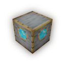
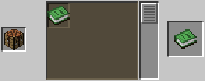
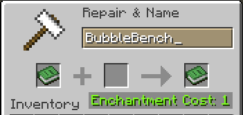

# BubbleWaves datapack
> **made by** BubbleF1sh\
> **last update:** 1.0 (XXXX Month ##)\
> **versions realised:** 0

### * Bubble Block
Every custom block from this datapack called Bubble Block [`bubble_block`]
### * Bubble Item
Every custom item from this datapack called Bubble Item [`bubble_item`]

# Bubble Bench
> 
> ### **CRAFTING**
> \
> To get this block you have to craft Knowledge Book inside Stonecutter and then rename it to BubbleBench inside Anvil. (After you take renamed book you'll get actual bench).
> ### **USING**
> This block is using to get other stuff from this datapack.
